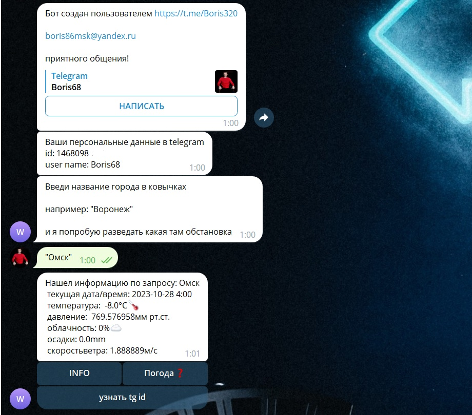

# TGBot
## Telegram Bot мой проект "для души"

Это пока-что совсем простой по функцианалу TG-bot, написанный на java (ну разумеется)
и SpringBoot. Подобные боты и именно в телеграм набирают обороты, они уже достаточно 
популярны и во всю проникают в бизнес-проекты, по этому не стоит
упускать возможность освоить их!

Бот развернут на хостинге на ОС Ubuntu, вы можете не только посмотреть его код, признаться
не совсем "стройный", потому как это "проба пера" и "для души" но и попробовать
непосредственно [Мой бот!](https://t.me/boris68_bot)

